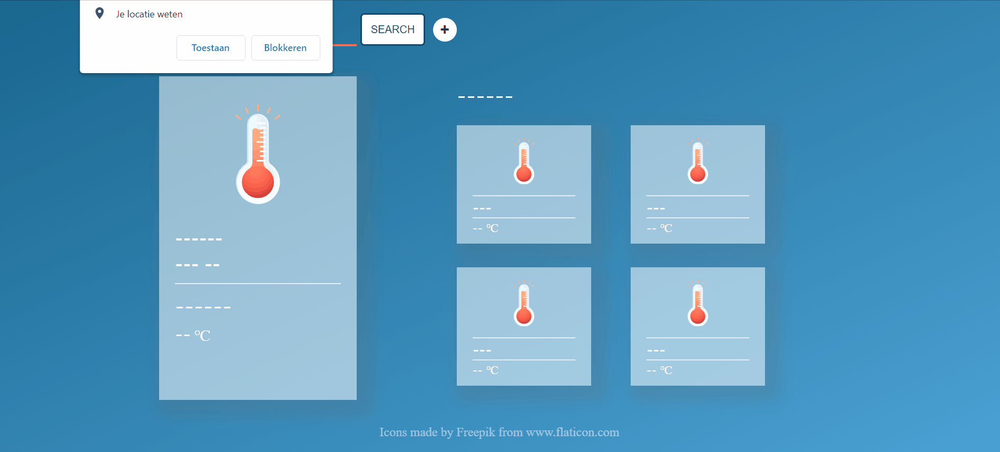

# :partly_sunny: Weather Application

Individual project/challenge given to me by [BeCode](https://github.com/becodeorg). 

I have build a weather application to display the weather of any given city.
The user enters a city of his/her choice and the weather for the next 5 days will display.
The goal of this project was to learn AJAX and work with an API.

## :eyes: Have a look 

## :wrench: Tools
- Visual Studio Code
- HTML, CSS, JavaScript, Markdown
- OpenWeather
- Google (of course)
- YouTube
- Flaticon

## :pray: Thanks to
[BeCode](https://github.com/becodeorg)